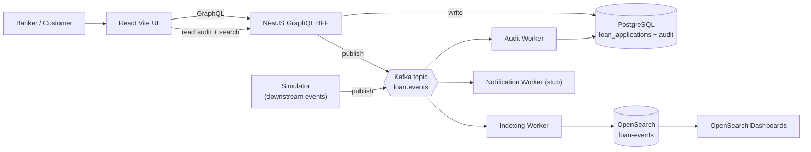

# Event-Driven Digital Loan Platform (Unloan-style)

A cloud-ready, event-driven **digital mortgage / loan origination** platform that simulates real-time banker operations — inspired by modern digital home-loan systems such as Unloan. The stack is a TypeScript monorepo with a **React** UI, a **NestJS GraphQL BFF**, async **Kafka** workers, **PostgreSQL** as the source of truth, and **OpenSearch** for operational insight.

## Key features

- **Real-time loan application processing** on a Kafka-compatible bus (Redpanda locally, MSK in AWS).
- **GraphQL BFF** for the frontend aggregation surface — thin resolvers, clear separation from the event backbone.
- **Event sourcing mindset**: every domain event is persisted as an immutable audit row and indexed for search.
- **OpenSearch dashboards** for operational insight (event volume, per-application timelines).
- **Simulated banker activity** for a live-looking demo (`off | normal | busy`) without needing real traffic.

## Architecture



See [docs/ARCHITECTURE.md](docs/ARCHITECTURE.md) for a submit-flow sequence diagram and component responsibilities.

## Demo

A short walkthrough of the dashboard and event stream will live at [docs/demo/](docs/demo/). Drop `demo.gif` (or `demo.mp4`) there and it renders inline:

<!--  -->

## Tech stack

**React | TypeScript | NestJS | GraphQL | Kafka (Redpanda) | PostgreSQL | OpenSearch | Docker | AWS-ready (ECS, RDS, MSK, OpenSearch Service)**

## Why this matters

Modern digital banks (Unloan, CommBank Kaizen, Up, etc.) settle the same three questions this repo makes explicit: how the UI gets a *shaped* read model (GraphQL BFF), how writes fan out to *many* downstream concerns without coupling (Kafka + workers), and how you keep the **transactional** database honest while still offering **search / analytics** on the same data (Postgres + OpenSearch). Everything here is a small, working version of those patterns.

## Engineering challenges

- **Idempotent Kafka consumers** — audit inserts use `ON CONFLICT (event_id) DO NOTHING` (see [apps/workers/src/lib/audit-sql.ts](apps/workers/src/lib/audit-sql.ts)) so a re-delivered message never double-records.
- **Event ordering per `applicationId`** — producers (API and simulator) use `applicationId` as the Kafka message key so all events for one loan land on the same partition in order.
- **GraphQL BFF vs internal event backbone** — the UI never talks to Kafka; resolvers stay thin and delegate to services (see [docs/adr/0001-graphql-bff.md](docs/adr/0001-graphql-bff.md)).
- **Transactional DB vs search index** — Postgres is source of truth; OpenSearch is rebuilt from the event stream and can be dropped or re-indexed without data loss.
- **Local-to-cloud parity** — Redpanda (Kafka API) → MSK; Postgres → RDS; OpenSearch → OpenSearch Service; NestJS + workers → ECS / Fargate.

## Prerequisites

- Node **24** (see `.nvmrc`) and **pnpm** via Corepack
- **Docker** for Compose (Postgres, Redpanda, OpenSearch)

## Quick start

```bash
corepack enable
pnpm install
pnpm build
cp apps/api/.env.example apps/api/.env   # adjust if needed
pnpm docker:up                           # Postgres + Redpanda + OpenSearch
pnpm dev:api                             # http://localhost:3000/graphql
pnpm dev:web                             # http://localhost:5173
```

In separate terminals (after Docker is healthy):

```bash
pnpm --filter workers dev:audit       # audit consumer → Postgres
pnpm --filter workers dev:index       # indexing consumer → OpenSearch
pnpm dev:simulator                    # Phase 3: synthetic downstream events → Kafka
pnpm dev:notifications                # Phase 4: stub handler for NotificationSent
```

The web UI creates **draft** applications, **submits** them (emits `LoanApplicationSubmitted` to Kafka), polls **loan applications** every **3s**, and shows an **audit timeline** (Postgres) plus **search timeline** and **event overview** (OpenSearch). See [docs/PHASES.md](docs/PHASES.md) for the phase map.

## Testing

- `pnpm test` — Jest coverage for `apps/api` (statements/lines/functions **≥90%**, branches **≥80%**) and unit tests for `packages/shared`.
- `pnpm --filter api test:e2e` — lightweight GraphQL health check (no Docker required).

## Layout

| Path | Role |
|------|------|
| `apps/web` | Vite + React UI (the banker dashboard) |
| `apps/api` | NestJS GraphQL BFF |
| `apps/workers` | Event consumers (audit, indexing, notifications) |
| `apps/simulator` | Synthetic banker activity |
| `packages/shared` | Shared event envelope types (Zod) |
| `infra/docker` | `docker-compose` for the local stack |

## Scripts

| Command | Purpose |
|---------|---------|
| `pnpm dev:api` / `pnpm dev:web` | Run apps in dev mode |
| `pnpm dev:simulator` / `pnpm dev:notifications` | Phase 3–4 processes (Kafka) |
| `pnpm build` | Build all packages |
| `pnpm test` | Jest (API + shared) |
| `pnpm docker:up` / `pnpm docker:down` | Start/stop Docker stack |
| `pnpm docker:config` | Validate Compose file |

## Future upgrades

- **Next.js migration** of `apps/web` (App Router + SSR dashboard, `/api` routes as a thin BFF proxy) to align with Next.js-centric stacks used at CBA / Unloan-style teams.
- **Auth**: SSO for bankers, row-level authorization on loan applications.
- **AWS deploy**: Terraform/CDK for ECS + RDS + MSK + OpenSearch Service; CI/CD via GitHub Actions.
- **Observability**: OpenTelemetry traces threaded through `traceId` already present on every event envelope.
- **Demo recording**: capture a 30–60 s walkthrough for `docs/demo/demo.gif`.

Tracked in [docs/PHASES.md](docs/PHASES.md).

## License

MIT — see [LICENSE](LICENSE).
