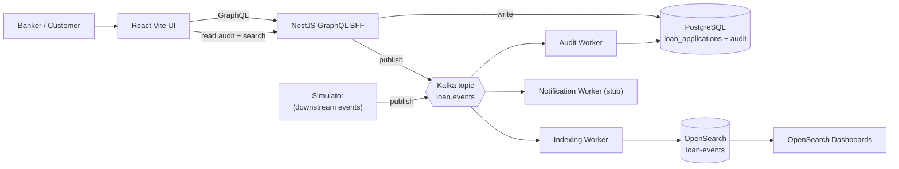
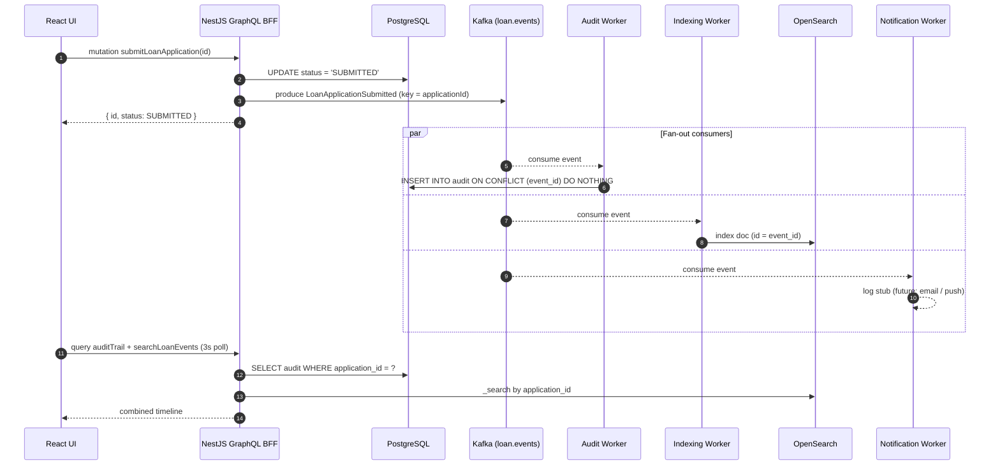

# Architecture

This document expands the top-level diagram in the [root README](../README.md) with a submit-flow sequence diagram and a component responsibilities table.

## High-level

## Submit flow (happy path)

When a banker clicks **Submit** on a draft loan application, the following sequence plays out. The UI never talks to Kafka or Postgres directly — it speaks only GraphQL to the BFF.

Key guarantees:

- **Idempotency** — re-delivered events never double-record. `audit_records` has a unique `event_id`; the indexing worker uses `event_id` as the OpenSearch document id so re-indexing is a no-op.
- **Ordering per application** — the Kafka message key is `applicationId`, so all events for one loan land on the same partition and are processed in order.
- **No UI ↔ Kafka coupling** — the UI only sees GraphQL. This keeps the public contract stable even if we swap Redpanda for MSK, or add new internal consumers.

## Components

| Component | Path | Responsibility |
|-----------|------|---------------|
| **Web UI** | `apps/web` | Banker dashboard. Vite + React. Talks GraphQL only. Polls every 3 s. |
| **GraphQL BFF** | `apps/api` | NestJS. Owns the Postgres write path and produces to `loan.events`. Exposes `loanApplications`, `auditTrail`, `searchLoanEvents`, `eventOverview`. |
| **Audit Worker** | `apps/workers` (`audit-main.ts`) | Kafka consumer → inserts every event into `audit_records` (idempotent). |
| **Indexing Worker** | `apps/workers` (`index-main.ts`) | Kafka consumer → indexes every event into OpenSearch `loan-events`. |
| **Notification Worker** | `apps/workers` (`notification-main.ts`) | Phase 4 stub. Filters `NotificationSent` events; logs structured JSON as a seam for email / push providers. |
| **Simulator** | `apps/simulator` | Phase 3. Publishes synthetic downstream events (credit check, document upload, approval, notification) to imitate banker + back-office activity. |
| **Shared events** | `packages/shared` | Zod-validated domain event envelopes (`DomainEvent`, `LOAN_EVENTS_TOPIC`). Single source of truth shared by API, workers, and simulator. |
| **Postgres** | `infra/docker` | Source of truth for `loan_applications` and `audit_records`. |
| **Redpanda** | `infra/docker` | Kafka-compatible broker for local dev. In AWS this becomes MSK. |
| **OpenSearch + Dashboards** | `infra/docker` | Search index and operational dashboards over the event stream. |

## Engineering challenges

See the **Engineering challenges** section of the [root README](../README.md#engineering-challenges) for the short list. The mapping to code:

- **Idempotent audit insert** — [apps/workers/src/lib/audit-sql.ts](../apps/workers/src/lib/audit-sql.ts) (`ON CONFLICT (event_id) DO NOTHING`).
- **Event-keyed ordering** — API producer + simulator both use `applicationId` as the Kafka key.
- **BFF vs event backbone** — see [docs/adr/0001-graphql-bff.md](./adr/0001-graphql-bff.md).
- **Transactional DB vs search index separation** — Postgres is authoritative; OpenSearch is rebuildable from the event stream.

## Local-to-cloud mapping

| Local (Docker) | AWS-managed equivalent |
|---------------|------------------------|
| Redpanda | MSK (Kafka) |
| Postgres | RDS / Aurora Postgres |
| OpenSearch | Amazon OpenSearch Service |
| NestJS API + workers | ECS Fargate tasks |
| React UI (Vite static) | S3 + CloudFront (or Amplify Hosting) |

Telemetry is already threaded through every event envelope (`traceId`), so wiring OpenTelemetry → X-Ray / Datadog is a drop-in change.
